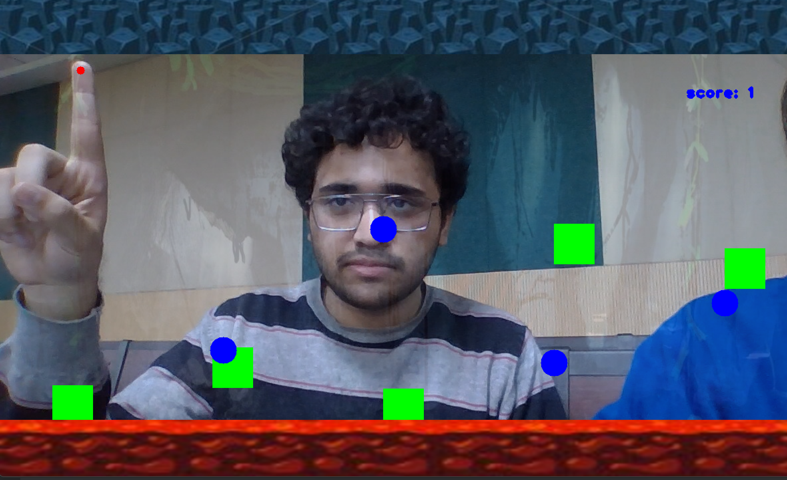
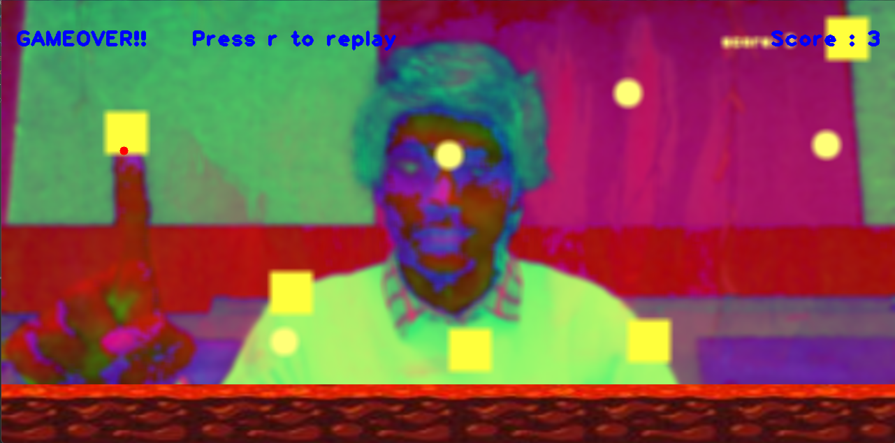

# Syntax-Error 2023
## Cave-Dash
###**Project Description**

The Problem Cave-Dash Solves:
Cave-Dash is a game that uses Hand Detection Technology and Python. It Provides an interactive game for its users through Computer vision and numpy.
It surely gets addictive once you get hooked on it.

### The Challenges we ran into:
Figuring out the landmarks of the index finger and patterns of the user and how the game should work.
We ran into multiple bugs such as the orientation of objects, Overlaying, and implementing the said intent of the game.
It took a while for us to debug the said Errors but we did not give up.

We ran into challenges every step of the way while using not so beginner-friendly python libraries. Figuring out, landmarks and their correlation with chord shapes. Then identifying and analysing hands separately and the strumming patterns of the user. Fixing lags between output and input to give a real-time flawless experience.

### Future Scope of this Project:

We wanted to implement many other features. Some of them are:
-Dynamic Overlaying Images of the objects like Stars on "Circle Points", Spaceship on "Index Point" and Comets on "Barriers"
-Hand Gesture Feature which implements jumping/pummelling 
via Opening and Closing of the Wrists
-Feature of "Levels ", "Maps", and "Hardness"(Easy/medium/hard)

### Installation
The installation process will recquire the following pre-requisites to be installed first 
```
pip install opencv-python
pip install numpy
pip install mediapipe
```
then you can clone the repository using git
```
git clone <link>
```
After the installation is complete, run the main.py file. 

### Usage
As soon as the Program runs, The game Starts:



Move your finger and Earn Points , After every 2 scores , speed increases , As soon as you an obstacle , Game ends with a  message "Game over , you can play again with 'r' " 



### Working
The Project firstly tracks your hands , stores its landmarks and and works according to following parameters:
-Generation frequency of Objects
-Creating points and Obstacle objects and removing it dynamically
-Checking if Obstacles 

### What's different about us:
-Our code is Easy to Read and Beginner Friendly
-We used limited modules and did not use any user-defined modules. Simply due to the reason that we wanted to write all the code from Scratch.
-We tried to implement ML algorithms to Smartly Generate the required objects
